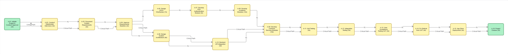
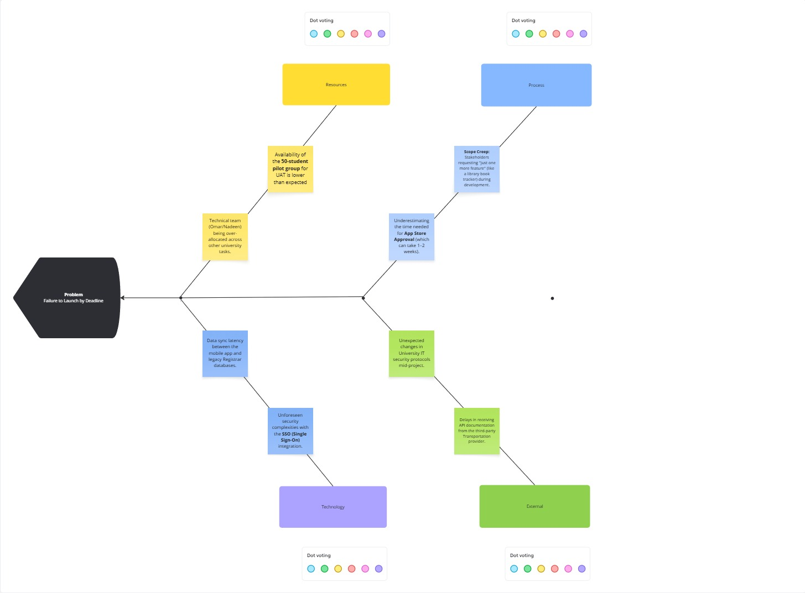

# 1. PROJECT CHARTER

---

### 1.1 Project Name and Description

**Project Name:** CampusConnect Mobile Application  

**Description:**  
The University currently relies on multiple legacy systems to deliver student services such as Grades, Campus News, Transportation, and Course Registration. Feedback from the Student Union indicates that 40% of students struggle to use these systems on mobile devices, resulting in missed deadlines and reduced engagement.

The CampusConnect project aims to consolidate these services into a single, unified mobile application for iOS and Android platforms, improving accessibility, usability, and overall student experience.

---

### 1.2 Vision and Purpose (Objectives)

**Vision:**  
To provide students with a seamless, mobile-first digital platform that serves as a single point of access for all essential university services.

**Objectives:**  
- Improve accessibility and ease of use of university services for students.  
- Increase student engagement with digital services.  
- Reduce missed registration deadlines.  
- Deliver a secure, reliable, and high-performing mobile application within the approved budget and timeline.

---

### 1.3 Project Scope

**In Scope:**  
- Development of native mobile applications for iOS and Android.  
- Secure Single Sign-On (SSO) integration with the University authentication system.  
- Core application modules:
  - Gradebook View  
  - Live Campus Bus Tracker  
  - Course Registration System  
  - Campus News Feed  
- User Acceptance Testing (UAT) with a pilot group of 50 students.

**Out of Scope:**  
- Web-based (desktop) portal redesign.  
- Tuition payment processing (planned for Phase 2).  
- Faculty and staff system interfaces.

---

### 1.4 Key Stakeholders
- Project Sponsor: Dean of Student Affairs  
- University IT Department  
- Registrar’s Office  
- Transportation Office  
- Student Union  
- Students  
- Student Clubs and Organizations  
- Mobile Application Development Team  

---

### 1.5 Identified Risks and Constraints

**Identified Risks:**  
- Technical Risk: Legacy system APIs may have slow response times, requiring caching or middleware solutions.  
- Schedule Risk: Delays in Apple App Store or Google Play Store approval processes may affect the launch date.  
- Privacy and Compliance Risk: Handling sensitive student data requires strict compliance with FERPA and GDPR regulations.

**Constraints:**  
- Fixed project budget of $50,000 USD.  
- Mandatory launch before the start of the Fall Semester.  
- Compliance with university IT security and data protection standards.

---

### 1.6 Project Budget

**Total Authorized Budget:** $50,000 USD  

- Personnel Costs: $30,000  
- Software and Licensing: $10,000  
- Marketing and Training: $5,000  
- Contingency Reserve (10%): $5,000  

---

### 1.7 Project Team Roles and Responsibilities

- **Project Sponsor:**  
  Provides strategic direction, approves funding, and authorizes major project decisions.

- **Project Manager (Ahmed Shaban):**  
  Responsible for overall project planning, execution, monitoring, and control.

- **University IT Team:**  
  Provides infrastructure support, security compliance oversight, and deployment readiness.

- **Student Pilot Group:**  
  Participates in User Acceptance Testing and provides feedback prior to full application launch.

---

### 1.8 Project Timeline and Milestones

- Phase 1 (Month 1, Week 1): Project Charter approval  
- Phase 2 (Month 2, Week 2): Requirements and design approval  
- Phase 3 (Month 4, Week 4): Development completion  
- Phase 4 (Month 5, Week 2): Beta testing and UAT  
- Phase 5 (Month 6, Week 4): Final App Store release  

---

### 1.9 Performance Indicators for Success

- At least 1,500 unique student downloads within 30 days of launch.  
- Application load time under 3 seconds on 4G/5G networks.  
- 99.9% uptime during course registration periods.  
- Project completed within the approved $50,000 USD budget and planned schedule.

---

# 2. Software Project Management Plan (SPMP)

## 2.1 Introduction / Overview of the Project
**Project Name:** CampusConnect Mobile Application  
**Description:** This project involves the development of a unified mobile portal for iOS and Android to centralize the University's legacy student services.  
**Purpose:** To eliminate the 40% navigation difficulty rate reported by students using current disparate systems and to ensure students meet critical academic deadlines via a mobile-first interface.  
**Objectives:** * Consolidate Grades, News, Transit, and Course Registration into one app.
* Achieve 1,500 student downloads within 30 days of launch.
* Maintain a performance threshold of <3s load time.

## 2.2 Project Organization
The project is managed under a **Matrix Structure**, utilizing experts from the University’s Students.
* **2.2.1 Project Sponsor:** Dr. Ahmed Shalaby (Dean of Student Affairs) – Funding and high-level approval.
* **2.2.2 Project Manager:** Ahmed Shaban – Leads integration, scheduling, and stakeholder management.
* **2.2.3 Development Team:** Omar Sholkamy & Ahmed Fahmy (Mobile); Omar Isleem (Backend/APIs).
* **2.2.4 Quality Assurance:** Nadeem Shokry – Leads System Integration Testing (SIT) and UAT.

## 2.3 Management and Technical Processes
### 2.3.1 Management Processes
* **Monitoring & Controlling:** Weekly reports are used to monitor the "Big Picture" and ensure all knowledge areas are coordinated.
* **Integrated Change Control (ICC):** Any change to the project scope, such as adding a "Tuition Payment" module, requires a formal Change Request and Sponsor sign-off to prevent budget overruns.

### 2.3.2 Technical Processes
* **Lifecycle Model:** A Hybrid approach using Waterfall for initial requirements and Agile Sprints for coding individual modules.
* **Technical Infrastructure:** Development will be hosted on AWS, using GitHub for version control and Jira for tracking software bugs.

## 2.4 Work to be Done
The project is divided into the following technical phases:
* **Requirement Analysis:** Mapping data fields from legacy systems to the new mobile API.
* **UI/UX Design:** Developing wireframes and prototypes for student feedback.
* **Implementation:** Coding the SSO Authentication, Gradebook, and GPS Transit modules.
* **Testing:** Conducting internal integration tests and a 50-student Beta (UAT) group.

## 2.5 Schedule and Budget Information
### 2.5.1 Milestone Schedule
* **M1:** Project Charter & PMP Approval – Month 1
* **M2:** Design Sign-off – Month 2
* **M3:** Development Completion – Month 4
* **M4:** UAT & Beta Testing – Month 5
* **M5:** Official App Store Release – Month 6

### 2.5.2 Budget Summary
| Category | Allocated Amount |
| :--- | :--- |
| **Personnel** | $30,000 |
| **Software/Licenses** | $10,000 |
| **Marketing** | $5,000 |
| **Contingency Reserve (10%)** | $5,000 |
| **Total Project Budget** | **$50,000** |

## 2.6 References to Other Project Planning Documents
* **Project Charter:** Finalized and signed on Oct 24, 2025.
* **Risk Register:** Tracks legacy API instability and App Store rejection risks.
* **IEEE Std 1058:** Guidelines used for this Software Project Management Plan.
* **FERPA/GDPR Policies:** Standards for protecting student data privacy.

# 3. Project Scope Management

Project Scope Management includes the processes required to ensure that the project includes **all the work required, and only the work required**, to successfully complete the CampusConnect Mobile Application project.

This section covers how project requirements are traced and how the total project work is structured and controlled.

---

### 3.1 Requirements Traceability Matrix (RTM)
**Category:** Project Document (Requirements Management)

The Requirements Traceability Matrix (RTM) is a key project document used during the **Collect Requirements** process to ensure that all project requirements are clearly identified, documented, and tracked throughout the project lifecycle.

In alignment with the Project Charter and stakeholder inputs, the RTM provides end-to-end traceability by linking each requirement to its source and monitoring its implementation status. This ensures that:
- No approved requirement is overlooked or omitted.
- All functional and non-functional requirements remain aligned with project objectives.
- Scope validation and scope control activities can be effectively supported during later project phases.

The RTM also serves as a control mechanism to assess the impact of proposed changes and helps prevent scope creep by ensuring that only approved requirements are implemented.

| Requirement No. | Name | Category | Source | Status |
| :--- | :--- | :--- | :--- | :--- |
| R-01 | Single Sign-On (SSO) | Functional | Project Charter | In Progress |
| R-02 | Gradebook Module | Functional | Registrar’s Office | In Progress |
| R-03 | Course Registration | Functional | Academic Affairs | In Progress |
| R-04 | Campus Bus Tracker | Functional | Transportation Office | Planned |
| R-05 | News Feed | Functional | Student Union | Planned |
| R-06 | Performance (<3s load) | Non-Functional | Project Objectives | Planned |
| R-07 | Data Privacy & Security | Non-Functional | FERPA/GDPR Policies | Planned |

---

### 3.2 Work Breakdown Structure (WBS)
**Category:** Scope Baseline

The Work Breakdown Structure (WBS) is a deliverable-oriented hierarchical decomposition of the total project scope and is developed during the **Create WBS** process. It defines **all the work required, and only the work required**, to successfully deliver the CampusConnect Mobile Application.

The WBS is created using the **decomposition technique**, where major project deliverables are progressively subdivided into smaller, more manageable components known as work packages. These work packages form the foundation for accurate schedule estimation, cost planning, resource allocation, and change control.

By organizing project work in this structured manner, the WBS ensures clarity of responsibilities, improves communication among stakeholders, and reduces the risk of scope creep.

#### 3.2.1 WBS Overview
The WBS provides a structured view of the project deliverables and ensures that no project work is overlooked while maintaining alignment with the approved project scope statement.

#### 3.2.2 WBS Hierarchy
1.0 CampusConnect Mobile Application  
1.1 Project Management  
1.2 Requirements & Design  
1.3 Development  
1.4 Testing  
1.5 Deployment & Launch  

#### 3.2.3 Scope Baseline
The scope baseline represents the approved version of the project scope and consists of:
- Approved Project Scope Statement  
- Work Breakdown Structure (WBS)  
- WBS Dictionary  

The scope baseline is used as a reference point for scope validation and scope control throughout the project lifecycle.

---

## 4. Activity List and Sequencing Activities

### 4.1 Defining Activities – Overview

Defining activities is a core process within **Project Schedule Management** that involves identifying the specific actions required to produce the project deliverables. Activities are derived directly from the Work Breakdown Structure (WBS) and are defined in sufficient detail to support accurate schedule development, sequencing, and control.

The primary output of this process is the **Activity List**, which includes all activities necessary to complete the project, along with their identifiers, descriptions, durations, and alignment with the WBS hierarchy.

---

### 4.2 Activity List

| Activity ID | Activity Name | Description | WBS ID | Duration (Days) |
| :--- | :--- | :--- | :--- | :--- |
| A-01 | Initiate Project & Charter Approval | Review, finalize, and formally approve the Project Charter | 1.1 | 2 |
| A-02 | Conduct Stakeholder Interviews | Gather functional and non-functional requirements from stakeholders | 1.2 | 5 |
| A-03 | Document System Requirements | Analyze, document, and validate system requirements | 1.2 | 5 |
| A-04 | Approve Requirements Baseline | Review and formally approve requirements baseline | 1.2 | 2 |
| A-05 | Design UI/UX Wireframes | Create UI/UX wireframes and prototypes | 1.2 | 7 |
| A-06 | Design System Architecture | Define backend and integration architecture | 1.2 | 6 |
| A-07 | Develop SSO Authentication Module | Implement secure authentication and login | 1.3 | 8 |
| A-08 | Develop Academic Modules | Implement gradebook and course registration modules | 1.3 | 12 |
| A-09 | Develop Campus Services Modules | Implement bus tracker and news feed modules | 1.3 | 10 |
| A-10 | Backend API Integration | Integrate legacy systems with backend services | 1.3 | 8 |
| A-11 | Unit Testing | Test individual system components | 1.4 | 6 |
| A-12 | Integration Testing | Test interaction between system modules | 1.4 | 5 |
| A-13 | User Acceptance Testing (UAT) | Conduct beta testing with student users | 1.4 | 5 |
| A-14 | Fix Defects from UAT | Resolve issues identified during UAT | 1.4 | 4 |
| A-15 | App Store Deployment | Submit and publish application to app stores | 1.5 | 3 |
| A-16 | Project Closure | Final documentation, handover, and sign-off | 1.1 | 2 |

---

### 4.3 Sequencing Activities

Sequencing activities involves identifying and documenting the logical relationships among project activities. This process defines the order in which activities must be performed and provides a foundation for developing the **Network Diagram** and the **Project Schedule**.

Activity sequencing is based on technical dependencies, best practices, and project constraints identified during planning.

#### 4.3.1 Types of Dependencies

- **Mandatory Dependencies (Hard Logic):**  
  Activities that must follow a specific order due to the nature of the work, such as completing requirements documentation before system design.

- **Discretionary Dependencies (Soft Logic):**  
  Activities sequenced based on preferred practices, such as completing UI/UX design before development.

- **External Dependencies:**  
  Activities dependent on external entities, such as App Store approval processes.

---

### 4.4 Activity Sequencing Table

| Activity ID | Activity Name | Predecessor(s) | Relationship |
| :--- | :--- | :--- | :--- |
| A-01 | Initiate Project & Charter Approval | — | — |
| A-02 | Conduct Stakeholder Interviews | A-01 | FS |
| A-03 | Document System Requirements | A-02 | FS |
| A-04 | Approve Requirements Baseline | A-03 | FS |
| A-05 | Design UI/UX Wireframes | A-04 | FS |
| A-06 | Design System Architecture | A-04 | FS |
| A-07 | Develop SSO Authentication Module | A-05, A-06 | FS |
| A-08 | Develop Academic Modules | A-07 | FS |
| A-09 | Develop Campus Services Modules | A-07 | FS |
| A-10 | Backend API Integration | A-06 | FS |
| A-11 | Unit Testing | A-08, A-09 | FS |
| A-12 | Integration Testing | A-10, A-11 | FS |
| A-13 | User Acceptance Testing (UAT) | A-12 | FS |
| A-14 | Fix Defects from UAT | A-13 | FS |
| A-15 | App Store Deployment | A-14 | FS |
| A-16 | Project Closure | A-15 | FS |

---

## 5. Network Diagram

The Network Diagram is a graphical representation of the logical relationships among project activities. It is developed after the completion of **Defining Activities** and **Sequencing Activities**, and it visually illustrates the flow of work required to complete the project.

The diagram represents activities as nodes and shows the dependencies between them using arrows. For the CampusConnect Mobile Application project, the network diagram is based primarily on **Finish-to-Start (FS)** relationships.

---

### 5.1 Network Diagram Representation

  
The network diagram illustrates the logical dependencies between project activities as identified during the activity sequencing process. Activities are connected using arrows to represent their relationships and execution order.

---

### 5.2 Description of Activity Flow

- The project begins with **A-01 (Initiate Project & Charter Approval)** and proceeds sequentially through requirements definition and approval.
- After **A-04 (Approve Requirements Baseline)**, design activities (**A-05 UI/UX Design** and **A-06 System Architecture**) are executed in parallel.
- Development activities converge at **A-07 (SSO Authentication Module)** and then branch into multiple implementation paths.
- Testing activities merge the development outputs and proceed sequentially through validation and deployment.
- The project concludes with **A-16 (Project Closure)**.

---

## 6. Gantt Chart

The Gantt Chart is a bar-chart representation of the project schedule that displays project activities along a timeline. It shows the planned start and finish dates of activities and highlights overlaps, sequencing, and overall project duration.

The Gantt Chart for the CampusConnect Mobile Application project is developed after completing the following schedule management processes:
- Defining Activities  
- Sequencing Activities  
- Estimating Activity Durations  
- Network Diagram and Critical Path Analysis  

---

### 6.1 Gantt Chart Representation

> 

The Gantt Chart illustrates project activities on the vertical axis and time periods on the horizontal axis. Each activity is represented by a horizontal bar whose length corresponds to its estimated duration.

Milestones such as *Project Charter Approval*, *Requirements Approval*, and *App Store Release* are represented as significant zero-duration points on the chart.

---

### 6.2 Relationship to Network Diagram and Critical Path

The Gantt Chart is derived from the Network Diagram and incorporates the results of the Critical Path Analysis. While the Network Diagram emphasizes logical dependencies between activities, the Gantt Chart focuses on the time dimension of the project.

Activities on the critical path are closely monitored, as any delay in these activities will directly impact the overall project completion date.

---

### 6.3 Gantt Chart Usage in Schedule Control

During project execution, the Gantt Chart serves as a key tool for schedule monitoring and control. Actual start and finish dates are compared against planned dates to identify variances and take corrective actions when necessary.

The Gantt Chart is updated regularly to reflect project progress and approved schedule changes.

---
# 7. The Critical Path 

Based on the durations and dependencies in the activity list, the manual sequence of the critical path is:

**A-01** (2d) $\rightarrow$ **A-02** (5d) $\rightarrow$ **A-03** (5d) $\rightarrow$ **A-04** (2d) $\rightarrow$ **A-05** (7d) $\rightarrow$ **A-07** (8d) $\rightarrow$ **A-08** (12d) $\rightarrow$ **A-11** (6d) $\rightarrow$ **A-12** (5d) $\rightarrow$ **A-13** (5d) $\rightarrow$ **A-14** (4d) $\rightarrow$ **A-15** (3d) $\rightarrow$ **A-16** (2d)

**Total Critical Path Duration: 66 Working Days**

---

## 8. Responsibility Assignment Matrix (RAM)

The Responsibility Assignment Matrix (RAM) is a project management tool used within **Project Resource Management** to assign project work to the appropriate organizational units or roles. It ensures that every work package or activity defined in the Work Breakdown Structure (WBS) has clear responsibility assigned to it.

According to the Project Resource Management processes, the RAM links **WBS elements** with the **Organizational Breakdown Structure (OBS)**, providing a clear view of who is responsible for performing and managing project work.

---

### 8.1 Purpose of the RAM

The RAM is used to:
- Clearly define responsibility for project work  
- Ensure that all work packages and activities are assigned  
- Improve coordination between project roles and teams  
- Support accountability and resource planning  

---

### 8.2 RAM Structure

In this project, the RAM maps **project activities** to **project roles**, ensuring that responsibility for each activity is clearly identified.

---

### 8.3 Responsibility Assignment Matrix (RAM)

| Activity ID | Activity Name | Project Manager | Development Team | QA Team | Project Sponsor |
| :--- | :--- | :---: | :---: | :---: | :---: |
| A-01 | Initiate Project & Charter Approval | R |  |  | A |
| A-02 | Conduct Stakeholder Interviews | A | R |  | C |
| A-03 | Document System Requirements | A | R | C |  |
| A-04 | Approve Requirements Baseline | R | C |  | A |
| A-05 | Design UI/UX Wireframes | A | R | C |  |
| A-06 | Design System Architecture | A | R | C |  |
| A-07 | Develop SSO Authentication Module | A | R |  |  |
| A-08 | Develop Academic Modules | A | R |  |  |
| A-09 | Develop Campus Services Modules | A | R |  |  |
| A-10 | Backend API Integration | A | R |  |  |
| A-11 | Unit Testing | A | C | R |  |
| A-12 | Integration Testing | A | C | R |  |
| A-13 | User Acceptance Testing (UAT) | A | C | R |  |
| A-14 | Fix Defects from UAT | A | R | C |  |
| A-15 | App Store Deployment | R | C |  | A |
| A-16 | Project Closure | R |  |  | A |

---

### 8.4 Use of RAM in Resource Management

The RAM is referenced throughout the project lifecycle to ensure that responsibilities remain clear and that resources are effectively utilized. It supports communication, performance monitoring, and conflict resolution within the project team.

---

## 9. RACI Chart

The RACI Chart is a responsibility assignment tool used in **Project Resource Management** to clearly define roles and responsibilities for project activities. It ensures that all stakeholders understand their level of involvement in each activity and helps prevent confusion, overlaps, or gaps in accountability.

RACI is a commonly used form of the Responsibility Assignment Matrix (RAM) and is especially effective in projects involving multiple stakeholders and functional teams.

---

### 9.1 RACI Definitions

The RACI model defines four types of responsibility:

- **R – Responsible:** The individual(s) who perform the work required to complete the activity  
- **A – Accountable:** The individual who is ultimately answerable for the correct completion of the activity (only one per activity)  
- **C – Consulted:** Individuals whose opinions or expertise are sought before decisions or actions are taken  
- **I – Informed:** Individuals who are kept informed about progress or outcomes  

---

### 9.2 Purpose of the RACI Chart

The RACI Chart is used to:
- Clarify roles and responsibilities across project activities  
- Ensure clear accountability for all activities  
- Improve communication among project stakeholders  
- Support effective coordination and decision-making  

---

### 9.3 RACI Chart for the CampusConnect Project

| Activity ID | Activity Name | Project Manager | Development Team | QA Team | Project Sponsor |
| :--- | :--- | :---: | :---: | :---: | :---: |
| A-01 | Initiate Project & Charter Approval | R | I | I | A |
| A-02 | Conduct Stakeholder Interviews | A | R | I | C |
| A-03 | Document System Requirements | A | R | C | I |
| A-04 | Approve Requirements Baseline | R | C | I | A |
| A-05 | Design UI/UX Wireframes | A | R | C | I |
| A-06 | Design System Architecture | A | R | C | I |
| A-07 | Develop SSO Authentication Module | A | R | I | I |
| A-08 | Develop Academic Modules | A | R | I | I |
| A-09 | Develop Campus Services Modules | A | R | I | I |
| A-10 | Backend API Integration | A | R | I | I |
| A-11 | Unit Testing | A | C | R | I |
| A-12 | Integration Testing | A | C | R | I |
| A-13 | User Acceptance Testing (UAT) | A | C | R | I |
| A-14 | Fix Defects from UAT | A | R | C | I |
| A-15 | App Store Deployment | R | C | I | A |
| A-16 | Project Closure | R | I | I | A |

---

### 9.4 Use of the RACI Chart in Project Execution

The RACI Chart is referenced throughout project execution to ensure that responsibilities remain clear and that communication flows effectively among stakeholders. It also supports conflict resolution and helps the project manager monitor accountability.

The RACI Chart may be updated if project roles or responsibilities change as part of approved change control.

---
# Diagram 10: Cause-and-Effect (Ishikawa) Diagram

### **Problem Statement: Failure to Launch by Deadline**
This diagram (FishBone.jpg) identifies the root causes that could prevent the **CampusConnect** app from meeting its mandatory launch date. Identifying these factors allows the team to focus on quality control and risk mitigation.

---

### **1. Resources (People)**
* **Pilot Group Availability:** Potential low participation from the **50-student pilot group** may delay the final **User Acceptance Testing (UAT)** phase.
* **Team Over-allocation:** Key technical staff like **Omar Emad** and **Nadeen Shokry** may be distracted by other university IT requirements.

### **2. Process (Management)**
* **Scope Creep:** Stakeholder requests for extra features (e.g., Library integration) during the development phase can push the schedule past 66 days.
* **App Store Approval Lead Times:** Underestimating the time required for Apple and Google to review and approve the app (typically 1–2 weeks).

### **3. Technology (Technical)**
* **Data Sync Latency:** Performance risks involving slow response times from the university's legacy Registrar databases.
* **Security Complexities:** Difficulties in integrating the **Single Sign-On (SSO)** system securely across both iOS and Android.

### **4. External (Environment)**
* **Policy Changes:** Unforeseen shifts in University IT security or data protection standards mid-project.
* **Third-Party Documentation:** Delays in receiving API technical specs from the external transportation provider for the Bus Tracker module.

---

### **Visual Reference**

---

### **Presentation Script**
"For Diagram 10, we used a Fishbone analysis to look at our biggest threat: missing the Fall launch. While our schedule is set for 66 days, this diagram highlights that **SSO integration** and **Scope Creep** are the highest risks to our quality and timeline. By monitoring these 'bones,' **Ahmed Shaban** can ensure the project stays on track for the Student Union's needs".

## Document Approval and Sign-Off

| Role | Name | Signature | Date |
| :--- | :--- | :--- | :--- |
| Project Sponsor | Dr. Ahmed Shalaby |  |  |
| Project Manager | Ahmed Shaban |  |  |

---

## Project Team Acknowledgement

| Name | Role | Responsibility |
| :--- | :--- | :--- |
| Omar Emad Sholkamy | Backend Manger |  Monitoring |
| Ahmed Fahmy | BackEnd Developer | Deveolping|
| Nadeem Shokry | FrontEnd Manger | Monitoring |
| Omar Isleem | FrontEnd Developer | Deveolping |

---

## References
- Project Charter: CampusConnect Mobile Application  
- IEEE SPMP Guidelines  
- University IT Policies

---
